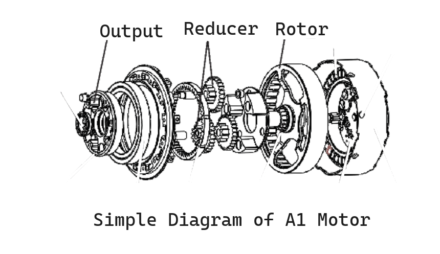

# README.md

motor任务作业第二部分实操：

exmaple/example_goM8010_6_position.cpp文件为运行逻辑，其中offset项已根据6个不同零点位置算出，电机上已标定第一次上电的0点，可通过人眼视觉直接估算出断电转动再上电后与原基准零点差几个零位，在注释中直接复制几个零位的弧度作为offset补偿即可。

最终产出的可运行文件在build/中，为example_goM8010_6_motor_position.

之后是unitree下载包中的官方readme文段。

### Notice

support motor: GO-M8010-6 motor、A1 motor、 B1 motor

gcc >= 5.4.0 (for x86 platform)

gcc >= 7.5.0 (for Arm platform) 

run gcc --version  command to check your gcc version

### Build
```bash
mkdir build
cd build
cmake ..
make
```

### Run
If the compilation is successful, many C++ example executable files will be generated in the build folder. Then run the examples with 'sudo', for example:
```bash
sudo ./example_a1_motor
```

If you need to run the Python example, please enter the "python" folder. Then run the examples with 'sudo', for example:
```python
sudo python3 example_a1_motor.py
```

### Tip

The code snippet below demonstrates an example of assigning values to the command structure `cmd` in `example_a1_motor.cpp`. It should be noted that the commands are all for the **rotor** side. However, the commands we usually compute are for the **output** side. Therefore, when assigning values, we need to consider the conversion between them.

```c++
cmd.motorType = MotorType::A1;
data.motorType = MotorType::A1;
cmd.mode  = queryMotorMode(MotorType::A1,MotorMode::FOC);
cmd.id    = 0;
cmd.kp    = 0.0;
cmd.kd    = 2;
cmd.q     = 0.0;
cmd.dq    = -6.28*queryGearRatio(MotorType::A1);
cmd.tau   = 0.0;
serial.sendRecv(&cmd,&data);
```



Typically, for kp and kd, assuming the motor's gear ratio is r, when calculating kp and kd on the rotor side, we need to convert kp and kd on the output side by dividing them by the square of r. 

$$kp_{\text{rotor}} = \frac{kp_{\text{output}}}{r^2}$$

$$kd_{\text{rotor}} = \frac{kd_{\text{output}}}{r^2}$$

This conversion relationship is demonstrated in the example `example_a1_motor_output.cpp`.By the way, in the example `example_a1_motor_output.cpp`, the kp on the rotor side is additionally divided by 26.07, and the kd on the rotor side is additionally multiplied by 100.0. These are magic numbers for the A1 and B1 motor. When controlling other motors, there is no need to consider these additional steps.
